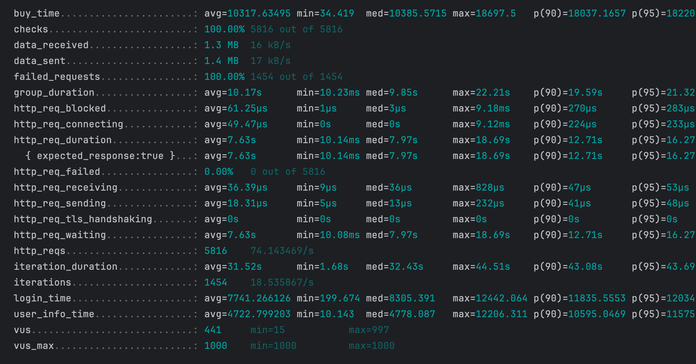

## Магазин мерча  

Сервис предоставляет REST API для выполнения операций, таких как аутентификация, управление товарами, транзакциями и инвентарем.

```*Описание задачи:*
Сервис, который позволит сотрудникам обмениваться монетками и приобретать на них мерч.  
- Каждый сотрудник должен иметь возможность видеть:  
1) Список купленных им мерчовых товаров,  
2) Сгруппированную информацию о перемещении монеток в его кошельке, включая:  
Кто ему передавал монетки и в каком количестве  
Кому сотрудник передавал монетки и в каком количестве  
```


### Project structure
```
├── Dockerfile                    # Dockerfile для сборки контейнера
├── Makefile                      # Makefile для автоматизации задач
├── README.md                     # Документация проекта
├── cmd
│   └── main.go                   # Точка входа в приложение
├── docker-compose.test.yml       # Docker Compose для тестовой среды
├── docker-compose.yml            # Docker Compose для основной среды
├── go.mod                        # Файл зависимостей Go
├── go.sum                        # Файл контрольных сумм зависимостей Go
├── internal
│   ├── config
│   │   ├── config.go             # Конфигурация приложения
│   │   └── config_test.go        # Тесты для конфигурации
│   ├── handler                   # Обработчики
│   │   ├── auth.go              
│   │   ├── handlers_test         # Тесты для обработчиков
│   │   │   ├── auth_test.go
│   │   │   ├── info_test.go
│   │   │   └── store_test.go
│   │   ├── info.go               
│   │   ├── store.go              
│   │   └── transaction.go        
│   ├── middleware
│   │   ├── cors.go               # Middleware для CORS
│   │   └── jwt.go                # Middleware для JWT
│   ├── models                    # Модели
│   │   ├── api
│   │   │   ├── request
│   │   │   │   └── request.go    
│   │   │   └── response
│   │   │       └── response.go   
│   │   └── entities
│   │       ├── inventory.go      
│   │       ├── item.go           
│   │       ├── transaction.go    
│   │       └── user.go           
│   ├── repository                # Репозиторий
│   │   ├── inventory.go          
│   │   ├── item.go               
│   │   ├── transaction.go        
│   │   └── user.go               
│   └── service                   # Сервисы
│       ├── auth.go               
│       ├── info.go               
│       ├── service_test          # Тесты для сервисов
│       │   ├── auth_test.go
│       │   ├── info_test.go
│       │   ├── mocks_test.go
│       │   ├── store_test.go
│       │   └── transaction_test.go
│       ├── store.go             
│       └── transaction.go       
├── loadtest.js                   # Скрипт для нагрузочного тестирования с использованием k6
├── migrations                        # Миграция
│   ├── 001_create_users_table.sql    
│   ├── 002_create_items_table.sql    
│   ├── 003_create_transactions_table.sql
│   ├── 004_create_inventary_table.sql   
│   └── down
│       └── 001_create_table.down.sql     # Откат миграций
└── test
    └── e2e
        ├── store_test.go          # End-to-end тесты для магазина
        └── transaction_test.go    # End-to-end тесты для транзакций
```


### Run  

```1) make run - запуск Docker контейнеров / make go - запуск main  
2) с помощью Postman подаются запросы для наглядного примера, как работает программа  
3) make test - запуск unit тестов  
4) make cover - покрытие кода  
5) make docker_test_e2e - запуск контейнера для тестов
6) make e2e - запуск е2е тестов
5) make check - запуск golangci.yaml  
6) make test_k6 - запуск нагрузочного тестирования  
```


##### P.S:  
- в данных из README, данного для выполнения тестового задания было указано, что "/api/buy/:item" - GET запрос,
я посчитала, что запрос выполняет функционал POST запроса.  
- скрытые файлы намеренно запушены, для лучшего понимания и управления программой  
- стиль написания форматов тестов разный - хотела пробровать разные реализации


*нагрузочное тестирование*

